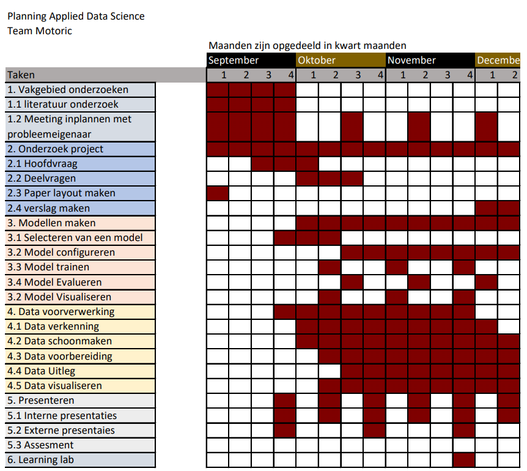

# Applied-Data-Science

<!-- DataCamp-->

  
DataCamp

    <ol>
      

   </ol>

<!-- Reflectie & evalutie -->

  
Reflectie & evalutie

  <ol>
  
  <!-- Eigen bijdrage -->
  

  
Eigen bijdrage

  <ol>
    
Aan het begin van Het project wilde ik, zoals gebruik was aan het begin van de projecten die zijn gevoerd tijdens mijn tijd aan de opleiding technische bedrijfskunde, een rolverdeling opzetten. Dit werd door de mede groepsgenoten niet noodzakelijk geacht. Doordat ik de eerste was die contact zocht met de probleemeigenaar, werd ik door de probleemeigenaar als aanspreekpunt gezien. Dus onbewust had ik de taak van communicatieleider in de groep en dit patroon zette zich ook door in het opzetten van vergaderingen en in het initiatief tonen met betrekking tot de communicatie naar andere partijen.  
Tijdens het project heb ik bijgedragen aan verschillende onderdelen zoals: presentaties maken, presenteren, het learning lab onderdeel samen met en teamgenoot opgezet en gepresenteerd, programmeren, aan het verslag werken en zoals eerder benoemd de communicatie naar de probleemeigenaar onderhouden.
Het grootste leerpunt voor mij als het gaat om mijn bijdrage aan het project is aan het eind van het project voorgevallen en is alsvolgt: 
    
Het overzicht verliezen 
    
Situatie: 
    
Ik had modellen gebouwd gebaseerd op een dataset die bestaat uit verschillende bij elkaar gevoegde dataframes. Vervolgens moest de code in een pijplijn geplaatst worden met zelf gemaakte functies. Iets waar ik minder goed in was. 
    
Taak: 
    
Als groepsgenoot van team Motoric had ik de taak om de stof die tijdens de minor Applied Data Science aan bod kwam tot mij te nemen en deze vervolgens te gebruiken om met ons gezamenlijk project een goed resultaat neer te zetten. 
    
Actie: 
    
Ik raakte in mijn hoofd de regie kwijt en dus ook in het project, waardoor mijn output onder de maat was. Ik nam een disfunctionele rol aan. 
    
Resultaat: 
    
Wat maakte dat ik niet tevreden ben met het uiteindelijke resultaat. 
    
Reflectie: 
    
Doordat ik geen overzicht meer had over de code, die ik als onderdeel van de groep wel moest hebben, blokkeerde ik. Er kwamen gedachten in mijn hoofd zoals: dit gaat nooit meer lukken, we hebben een slechte code, we redden het niet en we hadden het anders moeten doen. Door deze gedachten had ik het eigenlijk al opgegeven. Dit herken ik vaker in mijzelf dat wanneer ik in groepsverband  moet werken en het niet gaat zoals ik dat had gepland of had gewild, dat ik mij dan vaak van de groep en het gezamenlijk doel distantieer. In het vervolg moet ik mij openstellen en mij gevoel uitspreken in de groep. Dit kan door middel van een vertrouwenspersoon in de groep te vinden waar ik mijn gedachtes aan kan ventileren. Hierdoor wordt het makkelijker om met de groep te communiceren.  
(422 woorden)

    
  <!-- Leerdoelen -->
  

  
Leerdoelen

  <ol>

Om individuele ontwikkeling door te maken op het gebied van professionele vaardigheden in Applied Data Science had ik aan het begin van het project ontwikkeldoelen gesteld. Deze doelen hadden als onderwerp het verbeteren van mijn communicatieve vaardigheden en het op orde krijgen van mijn persoonlijke planning. 
Mijn communicatieve vaardigheden heb ik ontwikkeld tijdens besprekingen met de groep, begeleiders, opdrachtgevers en individuele gesprekken met groepsgenoten. Ook heb ik samen met iemand van het thuisfront gereflecteerd op het mailverkeer van en naar de opdrachtgever. 
Het verbeteren van mijn persoonlijke planning heb ik ontwikkeld door mijn agenda iedere schooldag bij te houden en deze vervolgens 1 maal per week te bespreken met iemand van het thuisfront. Tijdens deze besprekingen werd ook gereflecteerd op de week ervoor. Hoe ik deze had ervaren en wat ik anders had gedaan, zodat ik dit vervolgens kon toepassen in de planning voor aankomende week. 
    
Over het gehele project heb ik persoonlijke successen beleeft maar ook persoonlijke falen meegemaakt. Deze momenten van falen heb ik opgepakt als leermomenten en maakt mij sterkers in mijn professionele vaardigheden. In het volgende deel is een leermoment weergegeven uit mijn persoonlijke ontwikkeling tijdens het project uit. 
    
Situatie: 
Het was vrijdag en voor de week er na stond een presentatie gepland en we moesten een learning lab houden. Ik had voor beide verantwoordelijkheden genomen, waarvan ik eigenlijk al wist dat ik deze niet zou kunnen waarmaken. 
    
Taak: 
Als groepsgenoot van team Motoric had ik de taak om de stof die tijdens de minor Applied Data Science aan bod kwam tot mij te nemen en deze vervolgens te gebruiken om met ons gezamenlijk project een goed resultaat neer te zetten. 
    
Actie: 
Gefocust op het afmaken van mijn onderdeel van het learning lab en daarna meegeholpen aan de presentatie. 
    
Resultaat: 
Een goed voorbereid learning lab, een ondermaatse presentatie en teleurgestelde mensen in mijn persoonlijke omgeving 
    
Reflectie: 
Doordat ik verantwoordelijkheden aannam waarvan ik van te voren al wist dat dit niet goed zou uitkomen met mijn planning, heb ik mezelf en andere mensen teleurgesteld. Ik kwam mijn afspraken niet na en deed andere maar voor de helft. In het vervolg is het aan mij om werklast goed in te schatten en eerlijk te kijken of deze past binnen de al bestaande planning (de persoonlijke planning meegerekend). Dit kan in de toekomst beter door direct bij het verdelen van taken mijn agenda er bij te pakken en deze dan ook te bespreken met groepsgenoten. Waardoor groepsgenoten ook een inzicht krijgen in mijn planning. Want zolang je niks deelt kunnen ze ook nergens rekening mee houden. 
    
(427 woorden)

    

    
  <!-- Het project -->
  

  
Het project

  <ol>

 Voor de groepsevaluatie bespreek ik eerst een succes en een leerpunt van onze samenwerking en vervolgens geef ik reflecteer ik kort op het groepsproces door middel van de star methode. 
    
- Een succes tijdens onze samenwerking 
Het samenwerken tijdens de COVID-19 pandemie:  
Het is een groot compliment voor het team hoe wij hebben samengewerkt tijdens de pandemie en alle beperkingen die dit oplevert. Het team heeft iedere week geprobeerd om minimaal drie keer in de week op locatie te vergaderen om zo met elkaar samen te werken. Ook hadden wij iedere ochtend stand-up ingeroosterd waarbij de bevindingen van de dag er voor en de doelen voor de aankomende dagen werden besproken.  
    
- Een leerpunten tijdens onze samenwerking: 
Het verbinden van consequenties aan het niet nakomen van afspraken:  
Een leerpunt is voor het team om op een professionele manier harder te kunnen zijn naar elkaar. Het elkaar kunnen aanspreken op de verantwoordelijkheden die aangewezen afgesproken waren, ontbrak bij team Motoric gedurende het project. Dit resulteerde in het veelal te laat aanwezig zijn bij vergaderingen door het gehele team en het ontbreken van duidelijke deadlines. Hierdoor was de sfeer in de groep goed, maar ontbrak het op een gegeven moment aan resultaten. 
    Dit is in het vervolg te voorkomen door harde afspraken met elkaar te maken en wanneer iemand zich vervolgens niet aan die afspraken houdt, moet diegene hierop aangesproken worden. Ook kunnen deze thema’s vervolgens besproken worden bij de dagelijkse stand-up. 
    
De situatie die ik wil uitlichten heeft betrekking op het leerpunt tijdens onze samenwerking en is als volgt: 
    
Situatie: 
Het team was verdeeld in een groep die verantwoordelijkheid nam voor de paper en een deel voor de code. De paper was klaar tot de resultaten. De code was niet klaar. De groep van de paper stond stil. 
    
Taak: 
Ik was verantwoordelijk voor de paper 
    
Actie: 
Ik toonde begrip dat de code nog niet af was want ik begreep het zelf niet, dus ik kon er ook niks over inbrengen. 
    
Resultaat: 
De code was 3 weken te laat af, de code was minimaal en de paper moest gehaast geschreven worden. Wat vervolgens weer resulteert in een niet optimaal resultaat.
Vanaf het begin van het project duidelijke deadlines stellen en elkaar hier aan houden. Ook kan in het vervolg (sneller) beroep gedaan worden op de docenten wanneer iets niet duidelijk is. Deze gaven namelijk al in het begin van het project aan open te staan om ons te helpen en niet alleen om ons te beoordelen. 
    
(414 woorden)

    

    
  </ol>

<!-- Onderzoeks project -->

  
Onderzoeks project

  <ol>
    
  <!-- Taak omschrijving -->
  

  
Taak omschrijving

  <ol>
   Gebleken is dat bijna de helft van alle kinderen te weinig beweegt. Ook gaan kinderen minder vaak met de fiets naar school, blijven ze vaker binnen en zitten ze veel uren per dag. Hierdoor zijn de motorische vaardigheden van sommige kinderen verslechterd. Deze ontwikkeling is zorgwekkend vanwege de fysieke, emotionele, sociale en persoonlijke waarde van sport en bewegen voor kinderen. Daarom is het belangrijk dat kinderen al op jonge leeftijd lichamelijk actief zijn. Zo ervaren ze meer plezier tijdens het sporten. 
De basis voor deze elementen wordt gelegd door de kinderen van vier tot zes jaar. Het is daarom belangrijk om motorische achterstanden al op jonge leeftijd te ontdekken. Het is echter nog niet duidelijk welke kinderen het grootste risico lopen om een motorische achterstand te krijgen of te ontwikkelen, en welke kenmerken de grootste impact hebben op de motorische vaardigheidsontwikkeling. Dit leidt tot de onderzoeksvraag van dit rapport als volgt: 
- Hoe kan data science worden gebruikt om te voorspellen of een kind een jaar later kans heeft om een motorische achterstand te ontwikkelen?    
De hoofdvraag bestaad uit de volgende deelvragen:  
-	Welke biologische en socio-demografische variabelen hebben invloed op de motorische ontwikkeling van kinderen? 
-	Welk voorspellend model heeft het laagste percentage fout-negatieven?      
-	Welke biologische en socio-demografische kenmerken hebben de grootste invloed op het model?   
-	Welke kenmerken hebben de kinderen met een motorische achterstand gemeen?  
    
  </ol>

    
  <!-- Evaluatie & Conclusie -->
  

  
Evaluatie & Conclusie

  
Om onze hoofdvraag te beantwoorden, moeten we eerst onze deelvragen beantwoorden. 
Voor onze eerste deelvraag kon worden geconcludeerd dat niet alle gegevens die we ontvingen bruikbaar waren. We ontdekten bijvoorbeeld dat voor ons model de waargenomen motorische competentie niet zo nuttig was als we aanvankelijk hadden gedacht. De gegevens uit de vragenlijst uit T0-gegevens waren niet volledig genoeg om bruikbaar te zijn. Dit liet niet veel gegevens over om op te trainen, wat zou kunnen verklaren waarom onze modellen overbemeten zijn. 
    
Tijdens het onderzoek stuitten we op gegevens van het Centraal Bureau voor de Statistiek, maar we konden deze niet samenvoegen met onze t0-gegevens omdat de CBS-gegevens te complex waren. Voor toekomstig werk kan het nuttig zijn om gegevens van het Centraal Bureau voor de Statistiek te onderzoeken. 
Onze resultaten laten duidelijk zien dat het gebruik van een binaire classificatie het beste werkt voor ons onderzoek, omdat we alleen proberen te voorspellen of een kind motorische competentie zal missen, de verschillende categorieën doen er niet zoveel toe. 
    
Hoewel onderzoek suggereert om een Random Forest-model te gebruiken (Gokten en Uyulan, 2021) kwamen we na het uitvoeren en evalueren van verschillende modellen tot de conclusie dat het Random Forest niet geschikt is voor ons onderzoek en daarom moet worden verwijderd. In tabel (binaire classificatie) wordt afgebeeld dat het k-nearest-neighbours-model het beste presteerde voor ons onderzoek. De Bagging Classifier heeft het laagste percentage fout-negatieven, maar dit model past slechter dan kNN (zoals afgebeeld in de binaire classificatie van de tabel), dus hebben we besloten om het kNN-model te gebruiken om dit te voorkomen. 
    
Een mogelijke reden voor overfitting kan ook zijn dat we t0-gegevens hebben gebruikt voor het voorspellen van de MQ-categorie van t1, omdat de leercurve voor motorische vaardigheden op een bepaald moment steiler zal worden voor kinderen met goede motorische vaardigheden, terwijl deze zal afvlakken voor kinderen met slechte motorische vaardigheden ( Haga, 2009). 
Om de toekomstige motorische competentie van kinderen correct te kunnen voorspellen, zou er mogelijk meer variantie moeten zijn in de gegevens van de kinderen met lage motorische vaardigheden. Een jaar kan ook niet lang genoeg zijn om een ​​goede trend van de score per kind te krijgen. Een soortgelijk onderzoek toonde aan dat er een significant verschil is na 32 maanden (Haga, 2009).
We ontdekten in onze resultaten dat er geen gemeenschappelijke kenmerken zijn in onze dataset. Dit kan zijn omdat waargenomen motorische competentie geen invloed heeft op motorische vaardigheden. Ook omdat kinderen onder de acht jaar geen goed zelfbeeld hebben van hun vaardigheden (Morano, 2020).  
    

   
 <!-- Planning -->
  

  
Planning

  <ol>

 
 

    
  </ol>

<!-- Voorspellende analyse -->

  
Voorspellende analyse

  <ol>

  <!-- Model selecteren -->
  

  
Model selecteren

  <ol>

In machine learning, there are thousands of different prediction models. To make the right choice for the research between these models, it must first be clear what must be predicted. In order to predict a continuous target, a regression model is needed (Minaie, 2021). But for predicting a discrete target, a classification model should be used (Minaie, 2021). 
Because the Start(V)aardig research is aiming to predict whether someone has motoric skills, it is referred to as a classification model. Because a child is either classified as motor impaired or not. Phyton offers many options regarding classification models. The best-known classification models in the scikit-learn library were used for this research.
The basic classification models are (Minaie, 2021): 
    
Logistic Regression (LogReg):  
This classification model is used when there is a multiple classification purpose. This model is more suitable for linear cases when this model is compared to the KNN. 
    
KNN (or K-Nearest Neighbors): 
In general, this classification model is considered less efficient than a LogReg model and is used with non-linear solutions. As the name gives away, this model bases the classifications on the number of closest points (neighbours). 
    
The advanced classification models are (Minaie, 2021): 

Decision trees:  
are non-parametric supervised learning, which means that it is possible for these models to deal with outliers. However, these models quickly overfit to the training dataset, so it must be taken care to avoid this. Decisions trees also form the basis of better models such as: 
- Bagging models:  
These models fit the base classifier to arbitrary subsets of the original dataset and then aggregate them to get a definitive prediction. This can be done by voting or by means of the average. 
- RandomForest (Dmitrievsky, 2018):  
It can be said that a RandomForest is a special form of bagging. A RandomForest consists of a plurality of decision trees. Each tree is a simple model that has branches, nodes, and leaves. The nodes have the information on which the objective function depends. Then the value of the objective function moves to the leaves through the branches. Depending on certain conditions, the objective variables are given a certain classification. 
- GradientBoosting: 
In Boosting models, the trees with the highest accuracy score are drawn ahead. The trees with a lower accuracy score are weighted less heavily, so they have less impact on the final prediction. 

    

    
  <!-- Model configureren, trainen, evalueren en visualiseren -->
  

  
Model configureren, trainen, evalueren en visualiseren

  <ol>

Ik heb individueel aan de volgende vier modellen gewerkt: 
    - [K-nearest neighbours](https://github.com/joepvdz/Applied-Data-Science/blob/main/notebooks/8-12-21%20KNN.ipynb) 
    - [Random forest](https://github.com/joepvdz/Applied-Data-Science/blob/main/notebooks/8-12-21%20RF%20model.ipynb) 
    - [Bagging classifier](https://github.com/joepvdz/Applied-Data-Science/blob/main/notebooks/9-12-21%20Bagging%20classifier%20model.ipynb) 
    - [Gradient boosting](https://github.com/joepvdz/Applied-Data-Science/blob/main/notebooks/9-12-21%20GradientBoost%20model.ipynb) 
 

<!-- Domein kennis -->

  
Domein kennis

  <ol>
   
  <!-- Introductie in het vakgebied -->
  

  
Introductie in het vakgebied

  <ol>
   
 Motorische vaardigheden worden in het dagelijks leven gebruikt door te wandelen, hardlopen of fietsen. Deze vaardigheden beginnen zich al op jonge leeftijd te ontwikkelen en nemen in de loop van de tijd toe, vooral op de leeftijd dat ze naar school gaan. Een van de grootste problemen van de huidige samenleving is de toegankelijkheid van schermen zoals: tablets, laptops of andere spelcomputers op jonge leeftijd. Als gevolg hiervan blijven kinderen vaak thuis om van deze technologieën te profiteren in plaats van buiten met leeftijdsgenoten te spelen of aan sport te doen. Daarom is het belangrijk om de motorische ontwikkeling van kinderen al op zeer jonge leeftijd centraal te stellen.
 
 Gebleken is dat bijna de helft van alle kinderen te weinig beweegt. Ook gaan kinderen minder vaak met de fiets naar school, blijven ze vaker binnen en zitten ze veel uren per dag. Hierdoor zijn de motorische vaardigheden van sommige kinderen verslechterd. Deze ontwikkeling is zorgwekkend vanwege de fysieke, emotionele, sociale en persoonlijke waarde van sport en bewegen voor kinderen. Daarom is het belangrijk dat kinderen al op jonge leeftijd lichamelijk actief zijn. Zo ervaren ze meer plezier tijdens het sporten. 
De basis voor deze elementen wordt gelegd door de kinderen van vier tot zes jaar. Het is daarom belangrijk om motorische achterstanden al op jonge leeftijd te ontdekken. Het is echter nog niet duidelijk welke kinderen het grootste risico lopen om een motorische achterstand te krijgen of te ontwikkelen, en welke kenmerken de grootste impact hebben op de motorische vaardigheidsontwikkeling.
    

   
  <!-- Literatuur onderzoek -->
  

  
Literatuur onderzoek

  <ol>

Alvorens met dit project te beginnen, is er onderzoek gedaan om studies te vinden die enigszins verwant zijn aan dit project. Sommige van die onderzoeken hadden betrekking op fijne, andere op grove en andere op de ontwikkeling van zowel fijne als grove motoriek bij jonge kinderen die in de meeste onderzoeken tussen de drie en zes jaar oud waren. In studies zoals bijvoorbeeld van Wang (2020) en Abdullah et al. (2016) werden kinderen getest met verschillende fysieke oefeningen om hun status van motorische competentie te bepalen, wat een overeenkomst aantoont met deze studie die fysieke oefeningen ook als testmethode gebruikte. Een andere overeenkomst tussen bestaande studies en deze studie is het onderzoek van veel verschillende kenmerken of liever variabelen die kenmerkend zijn voor de kinderen, hun achtergrond en andere gerelateerde bijzonderheden, evenals het belang van elk afzonderlijk kenmerk (Gilbert, 1980b; de Meester et al. , 2020b). Verder werd in de studie van de Meester et al. een onderscheid gemaakt tussen feitelijke en waargenomen motorische competentie. (2020c), die ook in dit onderzoek terug te vinden zijn, omdat feitelijke en waargenomen motorische competentie afzonderlijk worden bekeken. Van belang waren ook studies van Wang et al. (2020) en Zysset et al. (2018) waarin ouderenquêtes of liever vragenlijsten zijn opgenomen en/of geëvalueerd, aangezien deze studie daar ook rekening mee houdt. 
    
Met alle overeenkomsten geven deze bestaande onderzoeken een interessant inzicht en kennis voor het onderwerp motorische ontwikkeling en een basisbegrip op dat gebied, wat nuttig is voor deze nieuwe studie, die tot doel heeft:'de ontwikkeling van motorische vaardigheden bij jonge kinderen te voorspellen', is nog steeds een kwestie van onbekend terrein en is nog nooit eerder in een studie behandeld.  
    
    

   
  <!-- Uitleg van termen, jargon en definities -->
  

  
Uitleg van termen, jargon en definities

  <ol>

## Motoric score
De MS is de uitkomst van de volgende formule: AST-1/50e percentiel(Gender en leeftijd gebonden)*100. Waarvan de AST-1 bestaat uit een tijd die een kind er over doet om een parkour af te leggen.  
    
## Motoric coefficient
De MC is de MS score geclassificeerd in één van de vijf categoriën. deze worden vervolgens als volgt ingedeeld: 
    - categorie 1: zware motorische achterstand 
    - categorie 2: motorische achterstand 
    - categorie 3: motorische gemiddelde score 
    - categorie 4: motorisch begaafd 
    - categorie 5: zwaar motorisch begaafd 
    
## BMI
De BMI van een kind wordt berekend door middel van de volgende formule: lichaamsgewicht in KG/(lichaamslengte in meter * lichaamslengte in meter)
    
## BMI score
Met behulp van de BMI, leeftijd en gender van een kind kan BMI score geclassificeerd worden in één van de drie categoriën. Deze worden als volgt ingedeeld:  
    - categorie 1: normaal gewicht  
    - categorie 2: overgewicht  
    - categorie 3: obesitas  

## Cerebrale Parese
CP is een blijvende aandoening van de hersenen met blijvende effecten voor de ontwikkeling van houding en beweging, ontstaan voor de eerste verjaardag, die leidt tot beperkingen in dagelijkse activiteiten. CP is een frequente oorzaak van bewegingsproblemen bij kinderen en komt voor bij ongeveer 2-2,5 van de 1.000 levendgeborenen. CP komt vaker voor bij kinderen met een zeer laag geboortegewicht, bij prematuren en bij kinderen met zuurstoftekort rond de bevalling. De manier van bevallen (natuurlijke bevalling of sectio) heeft nauwelijks invloed op het ontstaan van CP. Het verloop kan hierop wel van invloed zijn (strakke omstrengeling, foetale nood).
 
## Developmental Coordination Disorder
De belangrijkste criteria voor de diagnose DCD zijn dat de totaalscore of subscore op de Movement ABC-2 onvoldoende is, en dat de aandoening de schoolse prestaties of de algemene dagelijkse activiteiten voortdurend en in belangrijke mate beïnvloedt. 
De prevalentie van Developmental Coordination Disorder (DCD) bij schoolgaande kinderen ligt tussen de 1,7 en 19,0%, met een hogere prevalentie bij jongens dan bij meisjes. Deze variatie is afhankelijk van de definities die men in de literatuur gebruikt (zie bijlage 3 voor definities van CP en DCD). Het meest gerapporteerd wordt een prevalentiecijfer van 5-6%. Dit betekent dat in Nederland gemiddeld één op de 20 kinderen DCD heeft.
 

## Neuromusculaire aandoeningen
Neuromusculaire aandoeningen (NMA) ofwel spierziekten zijn zeldzaam en bijna altijd erfelijk. Ze tasten het functioneren van de spieren aan. Soms is bij de geboorte al duidelijk dat een kind een spierziekte heeft. Een NMA kan echter op elke leeftijd tot uiting komen. De meest voorkomende spierziekten zijn spierdystrofie van Duchenne, Becker spierdystrofie en spinale musculaire atrofie (SMA). Deze ziekten zijn ongeneeslijk.

NMA uiten zich in een vertraagde (psycho)motorische ontwikkeling die gepaard gaat met spierzwakte, hypotonie, hypermobiliteit, verminderde inspanningstolerantie, pijn en/of tintelingen in de spieren. NMA zijn meestal sterk invaliderend en vaak levensverkortend. Door een verminderde zelfredzaamheid kan het kind een verminderd welzijn ervaren. In een gezin hebben vaak meer kinderen een NMA. Het gezin ondervindt daarmee doorgaans zowel sociaal-emotionele als financieel-economische consequenties. Het is voor ouders van deze kinderen soms ook moeilijk realiseerbaar om allebei betaald werk te verrichten als ze de zorg hebben voor een kind met een dergelijke aandoening.

## Niet-aangeboren hersenletsel
Niet-aangeboren hersenletsel (NAH) wordt onderscheiden in traumatisch en niet-traumatisch hersenletsel. De gevolgen van NAH zijn blijvend. Ze kunnen lange tijd een verborgen karakter hebben omdat op jonge leeftijd nog weinig beroep wordt gedaan op hogere cognitieve functies die beschadigd kunnen zijn. Er zijn in Nederland geen prevalentiecijfers bekend voor de leeftijdscategorie die bij de JGZ in zorg is (0-18 jaar). Wel worden jaarlijks 19.000 personen tussen de 0-24 jaar gediagnostiseerd met hersenletsel, van wie 10% matig tot ernstig hersenletsel heeft.

Bij traumatisch hersenletsel is het letsel ontstaan door een oorzaak buiten het lichaam, zoals een val van een trap, een harde klap op het hoofd, het shaken baby-syndroom of binnendringende botgedeeltes als gevolg van schedelbreuk. Niet-traumatisch hersenletsel ontstaat door een proces in het lichaam, zoals een infectie van de hersenvliezen (meningitis), tumor, intoxicatie door drugs of alcohol, zuurstofgebrek (hypoxie/anoxie door rookvergiftiging), en epilepsie.
    
## Vertraagde en/of atypische motorische ontwikkeling
Een vertraagde of atypische motorische ontwikkeling wordt gekenmerkt door een later behalen van mijlpalen en/of een beperkte motorische variatie. Een vertraagde of atypische motorische ontwikkeling is niet gerelateerd aan andere pathologie of ontwikkelingsproblemen. Het is geen afwijkende ontwikkeling maar een extreme presentatie binnen het spectrum van de normale ontwikkeling. Een vertraging (zonder dat sprake is van pathologie of ontwikkelingsproblemen) kan ook het gevolg kan zijn van hypermobiliteit, hetgeen bij ongeveer van 6% van alle kinderen voorkomt. Indien hierbij geen sprake is van klachten wordt het beschouwd als een variatie van het normale. Indien er wel klachten bestaan (zoals pijn, problemen met schrijven en vermoeidheid), kan worden gedacht aan het Ehlers-Danlos Syndrome (het hypermobiele type), hetgeen echter niet vaak voorkomt (ongeveer 1 per 10.000 mensen).
    
## Ontwikkelingsprobleem als gevolg van onvoldoende beweging
Motorische ontwikkelingsproblemen kunnen ook ontstaan door onvoldoende beweging. De Beweegrichtlijn definieert een minimaal niveau van bewegen dat nodig is om gezondheidswinst te behalen. 
    
Onvoldoende beweging komt steeds meer voor en gaat vaak gepaard met overgewicht. Ook de ernst ervan neemt toe. De prevalentie is hoger in achterstandswijken, waar de mogelijkheden voor kinderen om te bewegen beperkt zijn. In deze wijken voldoet meer dan 95% van zowel de jongens als de meisjes niet aan de Beweegrichtlijn. Geleidelijk aan zien we dit probleem in alle lagen van de bevolking toenemen als gevolg van veel ‘gamen’, computeren en weinig fysiek spelexpert-opinion.

Behalve gunstige effecten voor de gezondheid (zoals de preventie van overgewicht) bestaan er ook aanwijzingen dat meer bewegen bij kinderen leidt tot een hoger gevoel van welzijn. Buiten bewegen in een natuurlijke omgeving draagt daar volgens sommige studies ook meer aan bij dan binnen bewegen. Mogelijke kosten ten gevolge van motorische problemen door onderstimulatie hangen samen met de mogelijke comorbiditeit en de extra benodigde inzet en investeringen van ouders om het kind alsnog te laten bewegen.
   
Onvoldoende beweging kan het gevolg zijn van:

- Omgevingsfactoren zoals een ongunstige fysieke omgeving, gebrekkig beleid van kinderopvang die kinderen onvoldoende in de gelegenheid stelt of ruimte biedt om te bewegen;
- Ouderfactoren: onderstimulatie;
- Onvoldoende financiële middelen van ouders;
- Kindfactoren zoals ziekten, handicaps, psychische of motorische problemen.

    
  </ol>

<!-- Data voorverwerking -->

  
Data voorverwerking

  <ol>
    
  <!-- Berekeningen met behulp van phyton -->
  

  
Berekeningen met behulp van phyton

  <ol>
    
 Voor mijn modellen heb ik de volgende variabelen berekend met behulp van phyton: 
    - [BMI score](https://github.com/joepvdz/Applied-Data-Science/blob/main/notebooks/BMI-category.ipynb) 
    - [MQ categorie van T1](https://github.com/joepvdz/Applied-Data-Science/blob/main/notebooks/MQT1.ipynb) 

    

  <!-- Verschillende dataframes gemaakt -->
  

  
Verschillende dataframes gemaakt

  <ol>
    
 Voor mijn modellen heb ik de volgende dataframes toegevoegd aan de [TO data](https://github.com/joepvdz/Applied-Data-Science/blob/main/T0_without_nan_columns.csv): 
    - [CBS data over inkomen per postcode](https://github.com/joepvdz/Applied-Data-Science/blob/main/notebooks/7-12-21%20exploring%20CBS%20income.ipynb) 
    - [CBS data over migratie achtergrond per postcode](https://github.com/joepvdz/Applied-Data-Science/blob/main/notebooks/7-12-21%20exploring%20CBS%20migration.ipynb) 
    - [CBS data over kerncijfers per postcode](https://github.com/joepvdz/Applied-Data-Science/blob/main/notebooks/8-12-21%20exploring%20CBS%20zipcode%20stats.ipynb) 
    - [Vragenlijst ingevuld door de ouders van het kind](https://github.com/joepvdz/Applied-Data-Science/blob/main/notebooks/7-12-21%20exploring%20Q.ipynb) 
    

    
  <!-- Dataframes samengevoegd, schoongemaakt en voorbereid voor de modellen -->
  

  
Dataframes samengevoegd, schoongemaakt en voorbereid voor de modellen

  <ol>
    
 De Dataframes uit de vorige paragraaf heb ik vervolgens in [DIT](https://github.com/joepvdz/Applied-Data-Science/blob/main/notebooks/7-12-21%20merging%20dataframes.ipynb) bestand samengevoegd, schoongemaakt en voorbereid voor de modellen.
    

    

<!-- Communicatie -->

  
Communicatie

  <ol>
    
  <!-- Presentaties -->
  

  
presentatie

  <ol>

 De volgende presentaties heb ik gepresenteerd en tevens ook gemaakt of een aandeel gehad in het maken van de presentatie.:  
    - [Interne Presentatie 2](https://github.com/joepvdz/Applied-Data-Science/blob/main/Presentations/Internal%20presentation%202.pptx)  
    - [Interne Presentatie 5](https://github.com/joepvdz/Applied-Data-Science/blob/main/Presentations/Internal%20presentation%205%20(lay%20out).pptx)  
    - [Interne presentatie 8](https://github.com/joepvdz/Applied-Data-Science/blob/main/Presentations/Internal%20presentation%208.pptx)  
    - [Learning lab](https://github.com/joepvdz/Applied-Data-Science/blob/main/Presentations/Learning%20Lab%20Motoric.pptx)  
    
  

    
  <!-- Paper schrijven-->
  

  
Paper schrijven

  <ol>

 Mijn aandeel in het schrijven van de [paper](https://github.com/joepvdz/Applied-Data-Science/blob/main/paper.docx) is als volgt:  
    - Lay-out van de paper opzetten  
    - introductie geschreven  
    - hoofdvraag en deelvragen geschreven  
    - het onderdeel Models geschreven  
    - het invullen van de resultaten  
    

    
   
  </ol>

    
  <!-- Bibliografie -->
  

  
Bibliografie

  <ol>

Alles over Sport. (n.d.). Start (V)aardig. Allesoversport.nl. Retrieved October 25, 2021, from https://www.allesoversport.nl/startvaardig/  
Annette Brons, Antoine de Schipper, Svetlana Mironcika, Huub Toussaint, Ben Schouten, Sander Bakkes, Ben Kröse (2021, April). Assessing Children’s Fine Motor Skills With Sensor-Augmnted Toys: Machine Learning Approach. JMIR Publications. Retrieved December 16, 2021, from https://www.jmir.org/2021/4/e24237  
Annina E. Zysset, Tanja H. Kakebeeke, Nadine Messerli-Bürgy, Andrea H. Meyer, Kerstin Stülb, Claudia S. 
Leeger-Aschmann, Einat A. Schmutz, Amar Arhab, Valentina Ferrazzini, Susi Kriemler, Simone Munsch, 
Jardena J. Puder, Oskar G. Jenni (2018, February). The validity of parental reports on motor skills 
performance level in preschool children: a comparison with a standardized motor test. NCBI. Retrieved 
December 16, 2021, fromhttps://www.ncbi.nlm.nih.gov/pmc/articles/PMC5899107/  
Borhannudin Abdullah, Wan Azira Abd Aziz, Aminuddin Yusof (2016, October). Level of motor skill development of preschool students. Journal of Physical Education and Sport (JPES). Retrieved December 17, 2021, from https://efsupit.ro/images/stories/3%20September2016/art%20175.pdf  
Brownlee, J. (2020). Data Preparation of Machine Learning. Jason Brownlee.  
Brownlee, J. (2020b, August 20). How to Choose a Feature Selection Method For Machine Learning. Machine Learning Mastery. Retrieved November 11, 2021, from https://machinelearningmastery.com/feature-selection-with-real-and-categorical-data/  
Brownlee, J. (2020c, August 2). A Gentle Introduction to k-fold Cross-Validation. Machine Learning Mastery. https://machinelearningmastery.com/k-fold-cross-validation/  
Buijs, A. (2017). Statistiek om mee te werken (10de editie). Noordhoff.  
Burduk, R., & Wozniak, M. (2012). Different decision tree induction strategies for a medical decision problem. Open Medicine, 7(2), 183–193. Retrieved November 11, 2021, from https://doi.org/10.2478/s11536-011-0142-x  
Byeon, H. (2019). Developing a random forest classifier for predicting the depression and managing the health of caregivers supporting patients with Alzheimer’s Disease. Technology and Health Care, 27(5), 531–544. Retrieved November 12, 2021, from https://doi.org/10.3233/thc-191738  
Chairilsyah, D. (2019). Web-Based Application to Measure Motoric Development of Early Childhood. JPUD - Jurnal Pendidikan Usia Dini, 13(1), 1–14. Retrieved Novermeber 12, 2021, from https://doi.org/10.21009/10.21009/jpud.131.01  
Centraal Bureau voor de Statistiek. (2019, December 10). Inkomensverdeling per postcodegebied (PC4), 2017. Retrieved December 17, 2021, from https://www.cbs.nl/nl-nl/maatwerk/2019/50/inkomensverdeling-per-postcodegebied--pc4---2017  
Centraal Bureau voor de Statistiek. (2021a, September 17). Bevolking; geslacht, migratieachtergrond, viercijferige postcode, 1 januari. Retrieved December 17, 2021, from https://www.cbs.nl/nl-nl/cijfers/detail/83503NED  
Centraal Bureau voor de Statistiek. (2021b, December 17). Kerncijfers per postcode. Retrieved December 17, 2021, from https://www.cbs.nl/nl-nl/dossier/nederland-regionaal/geografische-data/gegevens-per-postcode  
De Meester, A., Barnett, L.M., Brian, A. et al. The Relationship Between Actual and Perceived Motor Competence in Children, Adolescents and Young Adults: A Systematic Review and Meta-analysis. Sports Med 50, 2001–2049 (2020). . Retrieved December 15, 2021, from https://doi.org/10.1007/s40279-020-01336-2  
Dmitrievsky, M. (2018, July 6). The abstract description of the Random Forest algorithm. MQL5. Retrieved October 17, 2021, from https://www.mql5.com/en/articles/3856  
Dmitrievsky, M. (2018, July 6). RANDOM DECISION FOREST IN REINFORCEMENT LEARNING. mql5. Retrieved December 15, 2021, from https://www.mql5.com/en/articles/3856  
Gokten, E. S., & Uyulan, C. (2021). Prediction of the development of depression and post-traumatic stress disorder in sexually abused children using a random forest classifier. Journal of Affective Disorders, 279, 256–265. Retrieved December 17, 2021, from https://doi.org/10.1016/j.jad.2020.10.006  
Gilbert, J. (1980). An Assessment of Motor Music Skill Development in Young Children. Journal of Research in Music Education, 28(3), 167–175. Retrieved December 17, 2021, from https://doi.org/10.2307/3345234  
Hubáček, O., ŠOurek, G., & ŽElezný, F. (2018). Learning to predict soccer results from relational data with gradient boosted trees. Machine Learning, 108(1), 29–47. Retrieved December 15, 2021, from  https://doi.org/10.1007/s10994-018-5704-6  
Kazil, J., & Jarmul, K. (2016). Data Wrangling with Python: Tips and Tools to Make Your Life Easier (1st ed.). O’Reilly Media.  
Koehrsen, W. (2019, December 10). Hyperparameter Tuning the Random Forest in Python - Towards Data Science. Medium. Retrieved December 21, 2021, from https://towardsdatascience.com/hyperparameter-tuning-the-random-forest-in-python-using-scikit-learn-28d2aa77dd74q	  
Kuhn, M., & Johnson, K. (2019). Feature Engineering and Selection: A Practical Approach for Predictive Models (Chapman & Hall/CRC Data Science Series) (1st ed.). Chapman and Hall/CRC.  
Martin-Ruiz, M. L. (2015). Foundations of a Smart Toy Development for the Early Detection of Motoric Impairments at Childhood. International Journal of Pediatric Research, 1(2). Retrieved October 11, 2021, from https://doi.org/10.23937/2469-5769/1510011  
Meester, D. A. (2020, September 24). The Relationship Between Actual and Perceived Motor Competence in Children, Adolescents and Young Adults: A Systematic Review and Meta-analysis. SpringerLink. Retrieved December 8, 2021, from https://link.springer.com/article/10.1007/s40279-020-01336-2?error=cookies_not_supported&code=37b734cf-1842-49b4-a1db-a4832a112243  
Minaie, N., PhD. (2021, December 10). The Data Scientist’s Guide to Selecting Machine Learning Predictive Models in Python. Medium. Retrieved December 15, 2021, from https://towardsdatascience.com/the-beginners-guide-to-selecting-machine-learning-predictive-models-in-python-f2eb594e4ddc  
Monika Haga, Physical Fitness in Children With High Motor Competence Is Different From That in Children With Low Motor Competence, Physical Therapy, Volume 89, Issue 10, 1 October 2009, Pages 1089–1097, https://doi.org/10.2522/ptj.20090052  
Morano M, Bortoli L, Ruiz MC, Campanozzi A, Robazza C (2020) Actual and perceived motor competence: Are children accurate in their perceptions? PLoS ONE 15(5): e0233190. https://doi.org/10.1371/journal.pone.0233190  
Novakovic, J. D. J., Veljovic, A., Ilic, S. S., Papic, Z., & Tomovic, M. (2017). Evaluation of Classification Models in Machine Learning. UAV. Retrieved December 1, 2021, from https://uav.ro/applications/se/journal/index.php/TAMCS/article/view/158/126  
Plaia, A., Buscemi, S., Fürnkranz, J., & Mencía, E. L. (2021). Comparing Boosting and Bagging for Decision Trees of Rankings. Journal of Classification. Retrieved December 2, 2021, from https://doi.org/10.1007/s00357-021-09397-2  
RAMADHAN, M. M., SITANGGANG, I. S., NASUTION, F. R., & GHIFARI, A. (2017). Parameter Tuning in Random Forest Based on Grid Search Method for Gender Classification Based on Voice Frequency. DEStech Transactions on Computer Science and Engineering, cece. Retrieved December 17, 2021, from https://doi.org/10.12783/dtcse/cece2017/14611  
Sander J., Schipper A., Brons A., Mironcika S., Toussaint H., Schouten B., Kröse B. (unknown). Detecting delays in motor skill development of children through data analysis of a smart play device. Unknown. Retrieved October 11, 2021, from  https://digitallifecentre.nl/redactie/resources/finalpaperfinal.pdf  
Sia. (2019). Aanvraagformulier RAAK-PRO Start (V)aardig -2018. Nationaal Regieorgaan Praktijkgericht Onderzoek SIA.  
Schonig, S., Jasinski, R., Ackermann, L., & Jablonski, S. (2018, January). Deep Learning Process Prediction with Discrete and Continuous DataFeatures. ResearchGate. Retrieved December 17, 2021, from https://doi.org/10.5220/0006772003140319  
Wang, H., Chen, Y., Liu, J., Sun, H., & Gao, W. (2020). A Follow-Up Study of Motor Skill Development and Its Determinants in Preschool Children from Middle-Income Family. BioMed Research International, 2020, 1–13. Retrieved December 1, 2021, from https://doi.org/10.1155/2020/6639341  
Zhang, S., Li, X., Zong, M., Zhu, X., & Wang, R. (2018). Efficient kNN Classification with Different Numbers of Nearest Neighbors. IEEE Transactions on Neural Networks and Learning Systems, 29(5), 1774–1785. Retrieved December 2, 2021, from https://doi.org/10.1109/tnnls.2017.2673241  

 

